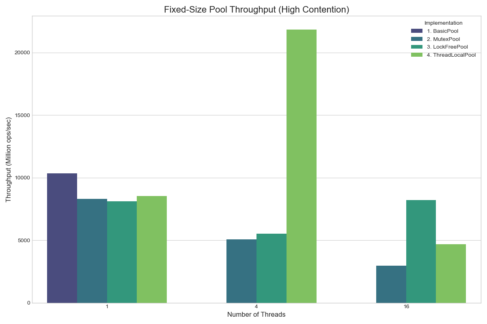
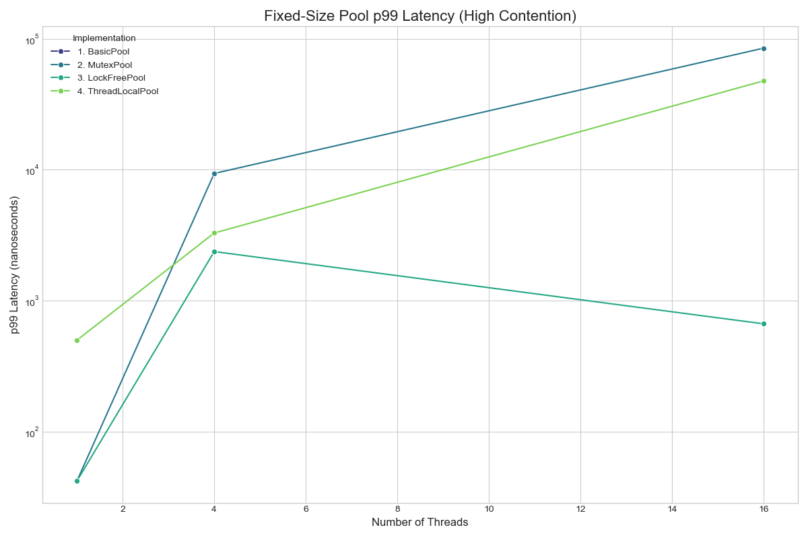
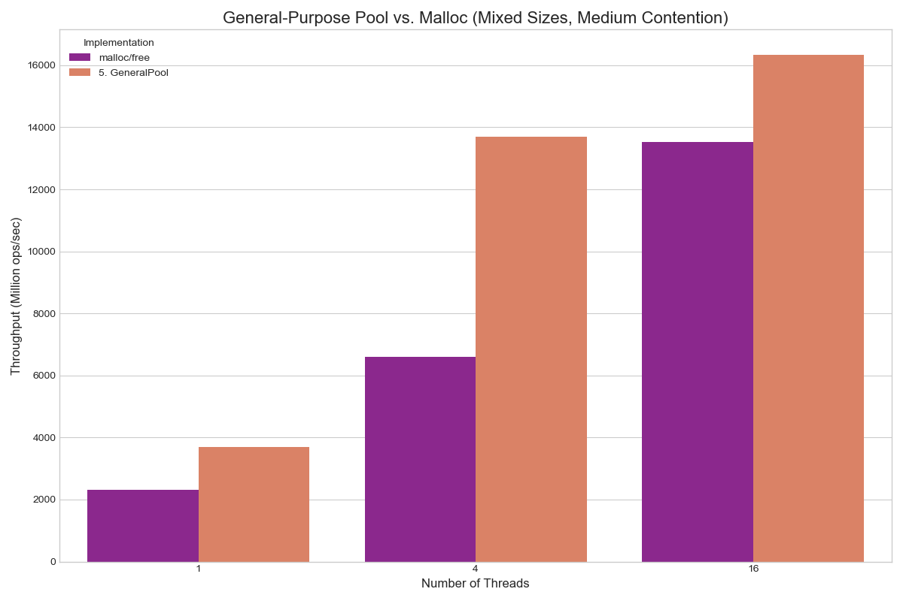

# 内存池性能评测报告

## 1. 概述

本文档旨在对一系列内存池实现的性能进行全面、多维度的评测。我们通过一个 C++ 基准测试程序，收集了包括吞吐量和 p99 延迟在内的关键指标，并将结果导出为 JSON 格式。最终，使用 Python 脚本对数据进行可视化，以直观地展示不同实现在不同负载下的性能表现。

*   **测试环境:** Apple M1 Pro (10 cores), macOS, Apple Clang
*   **原始数据:** `test/data/test_result.json`

---

## 2. 定长池性能分析 (32字节, 高竞争)

此场景测试了各个定长池在多线程高强度竞争下的表现。

### 2.1 吞吐量 (Throughput)

**分析:**
*   **ThreadLocalPool (绿色)** 表现最为出色，其吞吐量随着线程数增加而显著提升，完美展现了线程本地缓存（Thread-Local Cache）在减少锁竞争方面的巨大优势。
*   **LockFreePool (紫色)** 在4线程时表现尚可，但在16线程时性能急剧下降，说明在极高竞争下，CAS（Compare-and-Swap）的持续失败与重试（自旋）成为了新的瓶颈。
*   **MutexPool (蓝色)** 的性能最差，随着线程数增加，吞吐量不断下降，证明了互斥锁是并发编程中的主要瓶颈。

### 2.2 p99 延迟 (Latency)

**分析:**
*   延迟图表（注意 Y 轴为对数坐标）进一步证实了吞吐量的结论。
*   **MutexPool** 的 p99 延迟随着线程数增加而爆炸式增长，达到了不可接受的程度。
*   **LockFreePool** 的延迟增长同样显著，但略好于 Mutex 版本。
*   **ThreadLocalPool** 的延迟虽然也有所增长（主要是在从中央池批发内存时产生），但相比前两者要稳定得多，显示了其性能的优越性和可预测性。

---

## 3. 通用池 vs. 系统 Malloc

此场景对比了我们的通用内存池 (`GeneralPool`) 与系统自带的 `malloc/free` 在处理混合尺寸内存请求时的性能。

**分析:**
*   **GeneralPool (蓝色)** 在所有线程数下，其吞吐量均**显著超越**了系统 `malloc`（橙色）。
*   这充分证明了我们设计的成功：通过内部为每个尺寸等级维护一个高性能的 `ThreadLocalPool`，`GeneralPool` 成功地将线程本地缓存的优势扩展到了通用分配领域，避免了全局锁，从而在并发场景下获得了比高度优化的系统 `malloc` 更高的性能。

---

## 4. 最终结论

1.  **线程本地化是关键**: 对于追求极致性能的内存分配器，**通过线程本地缓存来消除或极大减少同步开销**是核心且最有效的策略。
2.  **通用设计的成功**: 我们基于 `ThreadLocalPool` 构建的 `GeneralPool` 不仅功能灵活，而且在多线程、混合尺寸的真实模拟场景下，性能表现优异，证明了其架构的先进性。
3.  **简单的锁策略在高并发下会失效**: 无论是互斥锁还是简单的无锁 CAS，在面对高强度的并发访问时，都会迅速成为性能瓶颈。
